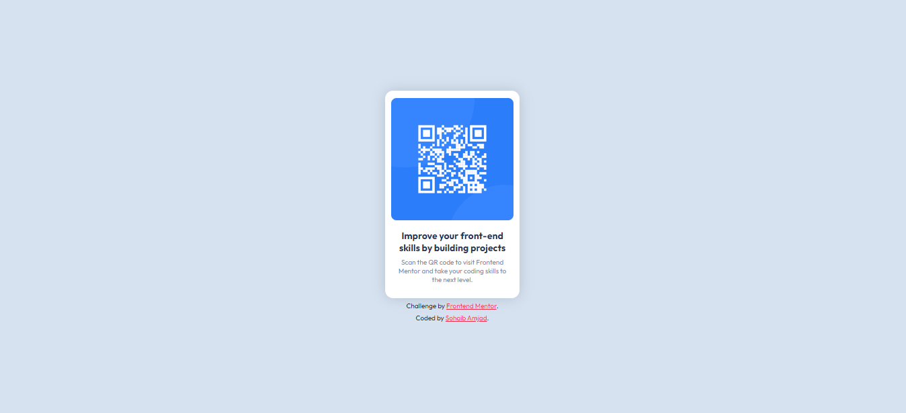

# Frontend Mentor - QR code component solution

This is a solution to the [QR code component challenge on Frontend Mentor](https://www.frontendmentor.io/challenges/qr-code-component-iux_sIO_H). And after solving this I agree that Frontend Mentor challenges do help you improve your skills. 

## Something Something About This Project

- [Overview](#overview)
  - [Screenshot](#screenshot)
  - [Links](#links)
  - [Built with](#built-with)
- [Acknowledgments](#acknowledgments)

## Overview

I got to know about FRONTEND MENTOR when I was just chatting away at Dev.to and someone on the platform recommended this website.

I immediately hoped on it and started my first challenge(this one).

### Screenshot

### Links

- Solution URL: [Add solution URL here](https://your-solution-url.com)
- Live Site URL: [Add live site URL here](https://your-live-site-url.com)

### Built with

- HTML5 markup
- CSS properties
- Flexbox
- Mobile-first workflow
- Media Query

## Acknowledgments

Credit: My only Developer Friend (Arslan)[https://github.com/mr-arsal] helped me out a little bit with Div Centering 😄.